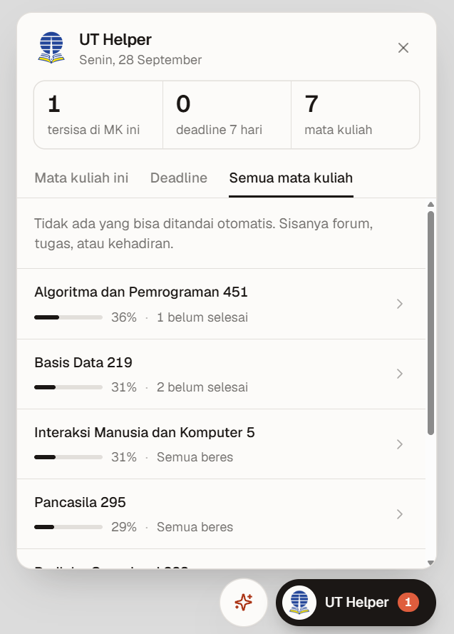
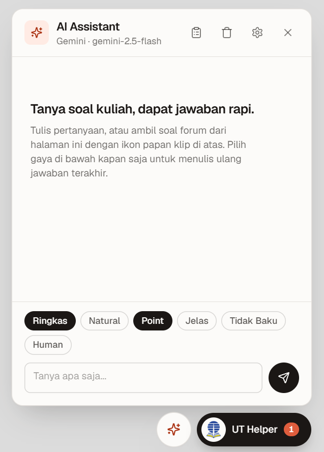
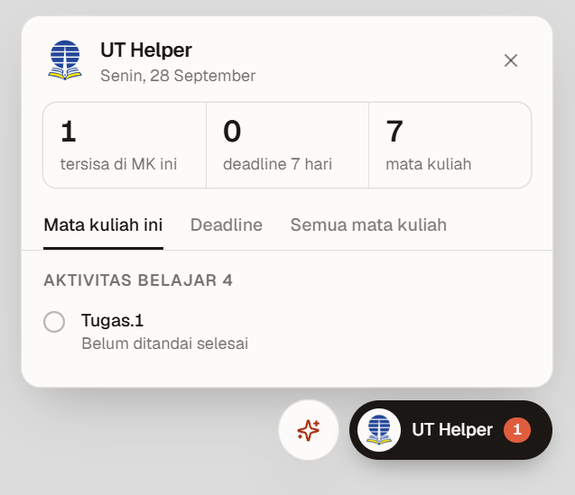
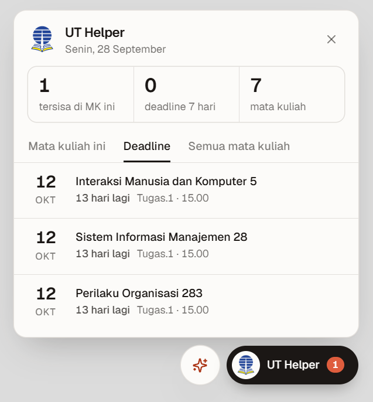
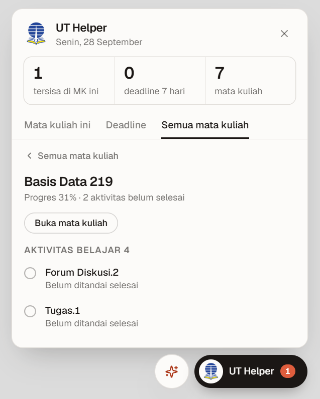
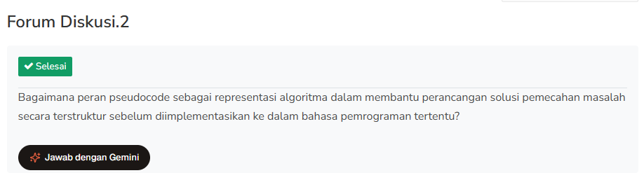
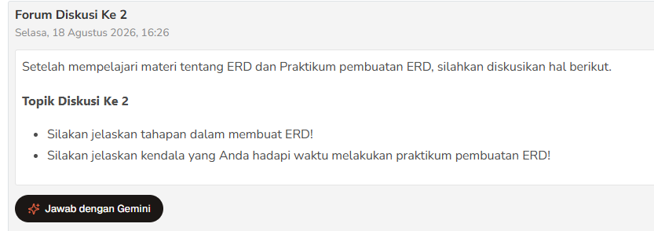

# UT Helper

Ekstensi Chrome buat mahasiswa Universitas Terbuka. Isinya hal-hal yang biasanya bikin repot di [elearning.ut.ac.id](https://elearning.ut.ac.id): ngecek deadline, nyari aktivitas yang belum ditandai selesai, ngisi kehadiran, sampai minta bantuan AI buat soal forum.

Ini proyek pribadi, bukan aplikasi resmi dari UT.

  
  

## Fitur

Setelah dipasang, di pojok kanan bawah e-learning muncul dua tombol: **UT Helper** (pakai logo UT) dan tombol AI (ikon bintang).

### Panel UT Helper

Di bagian atas ada tiga angka ringkasan. Kalau kamu lagi buka halaman mata kuliah, isinya: aktivitas yang belum selesai di mata kuliah itu, deadline 7 hari ke depan, dan jumlah mata kuliah aktif. Di halaman lain, angka pertama diganti jumlah semua deadline.

Di bawahnya ada tab:

- **Mata kuliah ini**, cuma muncul di halaman mata kuliah. Isinya daftar aktivitas yang belum ditandai selesai, dikelompokkan per sesi.
- **Deadline**, semua tugas yang akan jatuh tempo, lengkap dengan tanggal dan sisa waktunya. Yang tinggal kurang dari 3 hari diberi warna.
- **Semua mata kuliah**, progres tiap mata kuliah. Klik salah satu buat lihat aktivitas yang belum selesai tanpa harus buka mata kuliahnya.

  
  

### Tandai selesai

Ada tiga tombol, dari yang paling kecil cakupannya:

- **Tandai selesai** di tiap sesi.
- **Tandai semua** buat satu mata kuliah.
- **Tandai semua mata kuliah** di tab Semua mata kuliah, buat semuanya sekaligus.

Yang ikut ditandai: materi, file, link, dan label judul bagian seperti "MATERI INISIASI" atau "FORUM DISKUSI" (di Moodle, label itu juga punya tombol Tandai selesai sendiri). Yang sengaja dilewati: forum diskusi, tugas, serta kuis dan latihan (Tes Formatif, Latihan Sesi, dan sejenisnya), karena itu harus kamu kerjakan sendiri. Di daftar, kuis ditandai "Kuis/latihan, kerjakan sendiri" supaya nggak kelewat. Kehadiran juga dilewati, karena sudah diurus fitur di bawah. Setelah selesai, daftarnya dicek ulang ke Moodle, jadi yang tampil memang kondisi sebenarnya.

### Kehadiran otomatis

Tiap 15 menit, ekstensi ngecek semua mata kuliah yang lagi berjalan. Kalau ada "Kehadiran Sesi" yang sudah dibuka tutor tapi belum kamu isi, ekstensi jawab "Hadir", menyelesaikan lesson-nya biar nilainya kesimpan, lalu menandainya selesai. Tiap kali berhasil, muncul notifikasi.

Ini jalan di background, jadi tab e-learning nggak perlu dibuka. Syaratnya cuma dua: Chrome lagi nyala dan kamu masih login di e-learning.

### AI Assistant (Gemini)

- Tanya apa aja soal materi kuliah. Pertanyaan lanjutan tetap nyambung sama obrolan sebelumnya.
- Di halaman forum diskusi ada tombol **Jawab dengan Gemini** di bawah soalnya. Ini jalan di forum biasa (soalnya di deskripsi forum) maupun forum satu diskusi (soalnya di postingan pertama tutor).
- Ikon papan klip di panel AI ngambil soal dari halaman yang lagi kamu buka, termasuk halaman tugas, ke kolom chat.
- Pilih gaya jawaban: Ringkas, Natural, Point, Jelas, Tidak Baku, atau Human. Bisa lebih dari satu. Begitu kamu klik, jawaban terakhir langsung ditulis ulang pakai gaya itu.
- Tombol **Salin** di bawah tiap jawaban.
- Butuh API key Gemini sendiri, caranya ada di bawah.

Jawaban AI itu bahan buat kamu olah lagi, jangan langsung di-copy paste ke forum. Baca dulu, cek, lalu tulis ulang pakai pemahamanmu sendiri.

## Cara pasang

Yang kamu butuhin cuma Google Chrome. Nggak perlu install apa-apa lagi. Browser lain yang berbasis Chromium (Edge, Brave) harusnya bisa juga, tapi sejauh ini baru dicoba di Chrome.

1. Di halaman GitHub ini, klik tombol hijau **Code**, lalu **Download ZIP**.
2. Ekstrak ZIP-nya ke folder yang nggak bakal kamu hapus, misalnya `Documents/UT-Helper`. Chrome baca ekstensinya langsung dari folder ini, jadi kalau foldernya dihapus, ekstensinya ikut hilang.
3. Buka Chrome, ketik `chrome://extensions` di address bar, lalu Enter.
4. Nyalakan **Developer mode** (tombol geser di pojok kanan atas).
5. Klik **Load unpacked**, lalu pilih folder hasil ekstrak tadi. Pastikan yang kamu pilih folder yang di dalamnya langsung ada file `manifest.json`, bukan folder di atasnya.
6. Buka [elearning.ut.ac.id](https://elearning.ut.ac.id) dan login. Dua tombol tadi bakal muncul di pojok kanan bawah.

Izin yang dipakai ekstensi ini: akses ke elearning.ut.ac.id, penyimpanan (buat API key dan pengaturan), alarm (buat kehadiran tiap 15 menit), halaman offscreen (buat ngecek kehadiran di background), dan notifikasi. Detailnya bisa kamu lihat di `manifest.json` atau lewat tombol **Details** di `chrome://extensions`.

### Pasang API key Gemini

Cuma perlu kalau mau pakai fitur AI.

1. Buka [Google AI Studio](https://aistudio.google.com/apikey), login pakai akun Google, lalu klik **Create API key**.
2. Copy key-nya (biasanya diawali `AIza`).
3. Di e-learning, klik tombol AI (ikon bintang), lalu ikon gerigi di pojok atas panel.
4. Tempel key-nya, klik **Muat** buat milih model, lalu **Simpan**.

Google ngasih kuota gratis buat API key ini. Kalau kuotanya habis, AI-nya bakal nampilin pesan error dari Google, tinggal tunggu atau ganti model.

## Data kamu ke mana

- API key dan pilihan model disimpan di browser kamu sendiri (`chrome.storage`), nggak ikut ke mana-mana.
- Ekstensi cuma ngobrol sama `elearning.ut.ac.id` pakai login kamu yang sudah ada. Password kamu nggak pernah dibaca atau disimpan.
- Pertanyaan ke AI dikirim ke Google Gemini pakai API key kamu, dan cuma waktu kamu nanya.
- Font panel (Geist) diambil dari Google Fonts.

## Cara update

1. Download ZIP yang baru, lalu timpa isi folder lama.
2. Buka `chrome://extensions`, cari UT Helper, klik ikon **Reload** (panah melingkar).
3. Refresh tab e-learning yang lagi kebuka.

Kalau kamu pakai `git clone`, cukup `git pull` lalu lanjut ke langkah 2.

## Kalau ada masalah

- **Tombolnya nggak muncul.** Pastikan kamu sudah login, lalu refresh halaman. Kalau masih belum muncul, cek di `chrome://extensions` apakah UT Helper aktif dan ada tombol **Errors** merah.
- **Error setelah update.** Klik **Reload** di kartu ekstensi, lalu refresh semua tab e-learning. Kalau Chrome masih ngeluh ada file yang nggak ketemu (biasanya karena struktur folder berubah), klik **Remove**, lalu pasang lagi lewat **Load unpacked**. API key yang tersimpan ikut hilang, jadi isi ulang.
- **AI jawab "API key Gemini belum diisi".** Isi dulu key-nya lewat ikon gerigi.
- **Tombol Jawab dengan Gemini nggak ada di forum.** Tombol ini cuma muncul di halaman utama forum, bukan di halaman balasan orang lain. Kalau forumnya nggak punya soal yang kebaca, pakai ikon papan klip di panel AI atau copy soalnya manual.
- **Kehadiran nggak keisi.** Biasanya karena sesinya belum dibuka tutor. Ekstensi bakal nyoba lagi 15 menit kemudian.

## Kredit

- Logo Universitas Terbuka dari [Wikimedia Commons](https://commons.wikimedia.org/wiki/File:Logo_Universitas_Terbuka.MP4.png), lisensi [CC BY-SA 4.0](https://creativecommons.org/licenses/by-sa/4.0/). Tulisannya dipotong dan ukurannya diperkecil buat dijadikan ikon.
- Ikon lain dari [Lucide](https://lucide.dev) (lisensi ISC).
